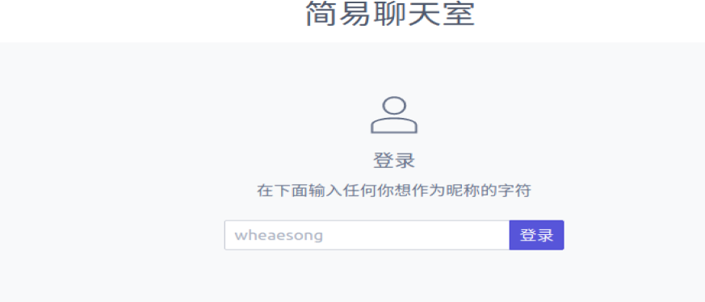
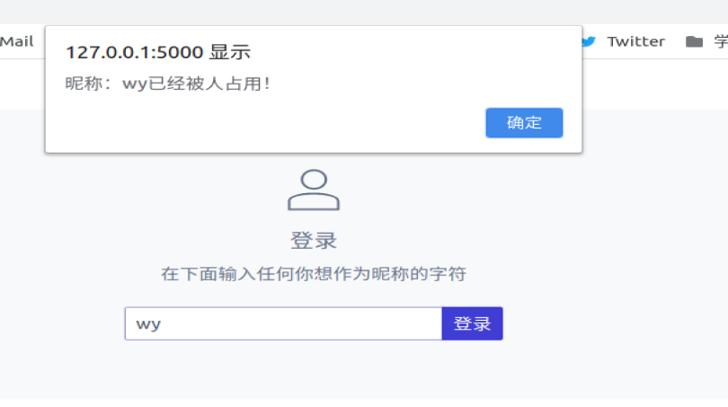
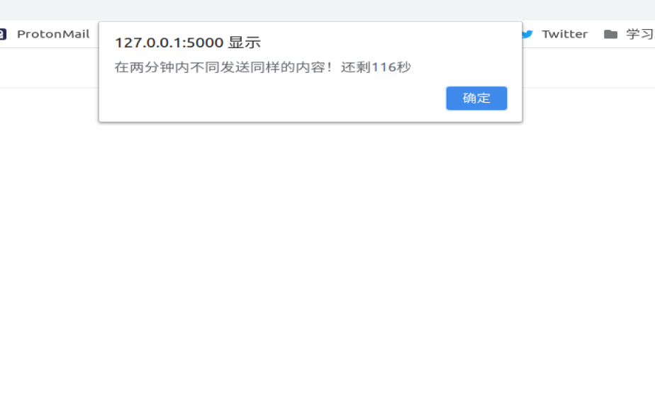
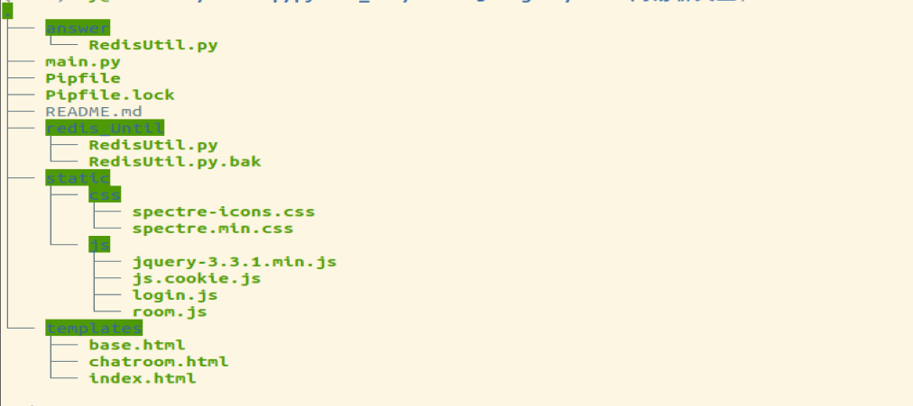
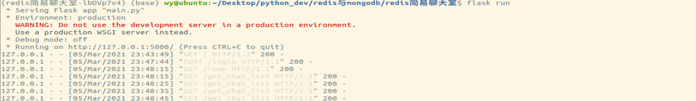

redis\_flask简易聊天室

项目构建
========

这时一个基于Redis数据库的简单小项目，使用redis缓存数据，并通过flask部署到浏览器，运行截图如下：

输入名字后，就可以登陆到聊天室，主要包括三个功能点：

1 、检查昵称防止重复

2、自动保存登录信息

>   即直接输入/room也可以进入聊天室，会使用上次使用的用户名

3、限制同一个用户刷屏

项目文件结构
============

主要文件说明：

1）、Pipfile与Pipfile.lock：pipenv配置运行环境的文件，用来记录运行项目所需的第三方库

2）、redis\_Until文件夹下的Redisuntil.py 项目运行的redis支持脚本

3）、main.py static、templates项目前台后台相关的文件

项目构建运行
============

如果主机上没有pipenv，需要先安装pipenv：

*sudo apt-get install pipenv*

然后pipenv依赖环境：

先切换到项目目录下，执行：

-   *pipenv install*

    安装完成后，即可运行：

    首先加入临时环境变量：

    *export FLASK\_TEMP=main.py*

    启动程序：

    *Flask run*

    项目启动后如图所示：

    

    需要注意的是需要提前启动redis服务

测试用例
========

打开redis-cli后，手动添加聊天信息：

*Lpush chat\_list ‘{“msg”:”信息内容”,”nick”:”username”,”post\_tieme”:”2021-3-6
15:45:00”}’*
